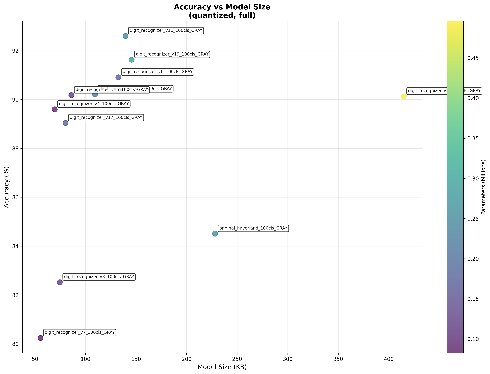

# Digit Recognition Benchmark Report

## 📊 Executive Summary

- **Test Date**: 2026-02-27 08:34:08
- **Models Tested**: 11 quantized models
- **Best IoT Model**: **digit_recognizer_v7.tflite** (55.5KB, 0.754 acc, 6692 inf/s)
- **Best Accuracy**: **digit_recognizer_v12.tflite** (0.892)
- **Fastest Model**: **digit_recognizer_v7.tflite** (6692 inf/s)
- **Smallest Model**: **digit_recognizer_v7.tflite** (55.5 KB)

## 📈 Performance vs Size

## 📋 Detailed Results

| Model | Size (KB) | Accuracy | Inf/s | Parameters | IoT Score |
|-------|-----------|----------|-------|------------|-----------|
| digit_recognizer_v7.tflite | 55.5 | 0.754 | 6692 | 82400 | 0.923 |
| digit_recognizer_v4.tflite | 69.5 | 0.829 | 5759 | 85800 | 0.876 |
| digit_recognizer_v3.tflite | 74.6 | 0.765 | 6215 | 121600 | 0.838 |
| digit_recognizer_v17.tflite | 80.2 | 0.826 | 4730 | 180400 | 0.812 |
| mnist_quantization.tflite | 71.7 | 0.792 | 4497 | 104800 | 0.811 |
| digit_recognizer_v15.tflite | 86.0 | 0.854 | 4595 | 113700 | 0.810 |
| digit_recognizer_v16.tflite | 139.5 | 0.884 | 3507 | 253000 | 0.720 |
| digit_recognizer_v6.tflite | 132.5 | 0.840 | 2437 | 171800 | 0.669 |
| original_haverland.tflite | 228.2 | 0.817 | 4395 | 257899 | 0.662 |
| digit_recognizer_v9.tflite | 159.5 | 0.852 | 2099 | 911500 | 0.644 |
| digit_recognizer_v12.tflite | 414.8 | 0.892 | 1459 | 496100 | 0.584 |

## 💡 IoT-Specific Recommendations

### 🏆 Dynamic IoT Model Selection

#### 🎯 Best Overall for ESP32
- **Model**: **digit_recognizer_v7.tflite**
- **IoT Score**: 0.923
- **Accuracy**: 0.754
- **Size**: 55.5 KB
- **Speed**: 6692 inf/s
- **Efficiency**: 0.0136 accuracy per KB

#### 📊 IoT Model Comparison (Under 100KB)
| Model | Accuracy | Size | Speed | IoT Score | Use Case |
|-------|----------|------|-------|-----------|----------|
| digit_recognizer_v7.tflite | 0.754 | 55.5KB | 6692/s | 0.923 | 🏆 **BEST BALANCED** |
| digit_recognizer_v4.tflite | 0.829 | 69.5KB | 5759/s | 0.876 | Alternative |
| digit_recognizer_v3.tflite | 0.765 | 74.6KB | 6215/s | 0.838 | Alternative |
| digit_recognizer_v17.tflite | 0.826 | 80.2KB | 4730/s | 0.812 | Alternative |
| mnist_quantization.tflite | 0.792 | 71.7KB | 4497/s | 0.811 | Alternative |

#### 🔧 Alternative IoT Scenarios

**For Accuracy-Critical IoT:**
- **Choice**: digit_recognizer_v15.tflite
- **Accuracy**: 0.854 (best under 100KB)
- **Trade-off**: 86.0KB size

**For Speed-Critical IoT:**
- **Choice**: digit_recognizer_v7.tflite
- **Speed**: 6692 inf/s (fastest under 100KB)
- **Trade-off**: 0.754 accuracy

**For Memory-Constrained IoT:**
- **Choice**: digit_recognizer_v12.tflite
- **Size**: 414.8KB (smallest with ≥85% accuracy)
- **Trade-off**: 0.892 accuracy

#### 📈 Efficiency Analysis
| Model | Acc/KB | Acc/Param | Parameters | Verdict |
|-------|--------|-----------|------------|---------|
| digit_recognizer_v7.tflite | 0.0136 | 9.154126213592233 | 82400 | 🎯 **OPTIMAL** |
| digit_recognizer_v4.tflite | 0.0119 | 9.658508158508159 | 85800 | ⚖️ Good |
| digit_recognizer_v3.tflite | 0.0103 | 6.292763157894736 | 121600 | ⚖️ Good |
| digit_recognizer_v17.tflite | 0.0103 | 4.577605321507761 | 180400 | ⚖️ Good |
| mnist_quantization.tflite | 0.0111 | 7.562022900763358 | 104800 | ⚖️ Good |

---
*Report generated automatically by Digit Recognition Benchmarking Tool*
