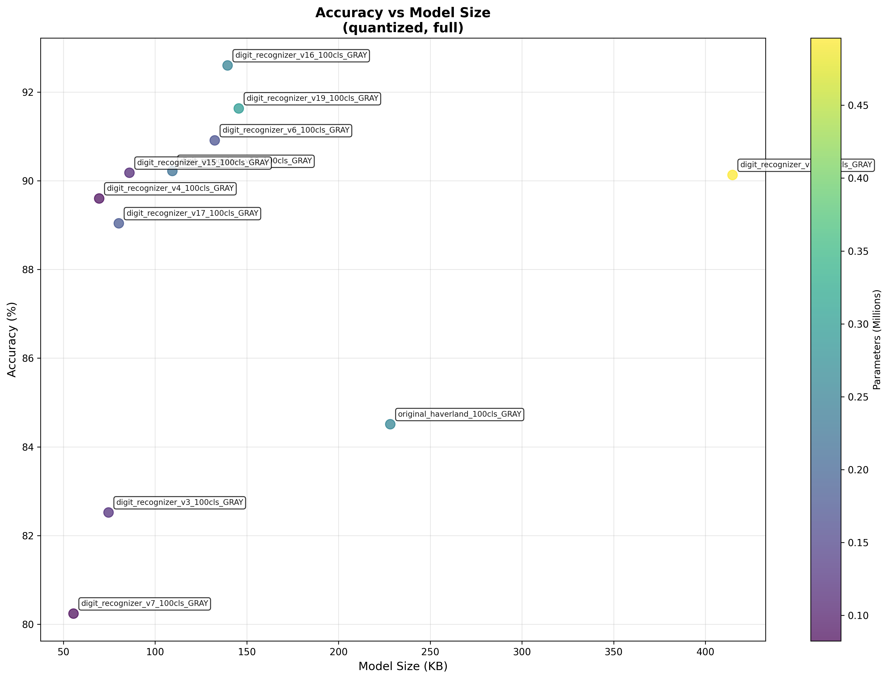

# Digit Recognition Benchmark Report

## 📊 Executive Summary

- **Test Date**: 2026-03-13 15:07:37
- **Models Tested**: 10 quantized models
- **Best IoT Model**: **digit_recognizer_v7.tflite** (55.5KB, 0.802 acc, 6227 inf/s)
- **Best Accuracy**: **digit_recognizer_v16.tflite** (0.926)
- **Fastest Model**: **digit_recognizer_v15.tflite** (6618 inf/s)
- **Smallest Model**: **digit_recognizer_v7.tflite** (55.5 KB)

## 📈 Performance vs Size

## 📋 Detailed Results

| Model | Size (KB) | Accuracy | Inf/s | Parameters | IoT Score |
|-------|-----------|----------|-------|------------|-----------|
| digit_recognizer_v7.tflite | 55.5 | 0.802 | 6227 | 82400 | 0.921 |
| digit_recognizer_v4.tflite | 69.5 | 0.896 | 5725 | 85800 | 0.896 |
| digit_recognizer_v15.tflite | 86.0 | 0.902 | 6618 | 113700 | 0.881 |
| digit_recognizer_v3.tflite | 74.6 | 0.825 | 6083 | 121600 | 0.853 |
| digit_recognizer_v17.tflite | 80.2 | 0.890 | 4777 | 180400 | 0.833 |
| digit_recognizer_v18.tflite | 109.4 | 0.902 | 4538 | 220600 | 0.776 |
| digit_recognizer_v16.tflite | 139.5 | 0.926 | 4261 | 253000 | 0.748 |
| digit_recognizer_v19.tflite | 145.6 | 0.916 | 3446 | 296200 | 0.713 |
| digit_recognizer_v6.tflite | 132.5 | 0.909 | 2494 | 171800 | 0.692 |
| original_haverland.tflite | 228.2 | 0.845 | 4234 | 257899 | 0.657 |

## 💡 IoT-Specific Recommendations

### 🏆 Dynamic IoT Model Selection

#### 🎯 Best Overall for ESP32
- **Model**: **digit_recognizer_v7.tflite**
- **IoT Score**: 0.921
- **Accuracy**: 0.802
- **Size**: 55.5 KB
- **Speed**: 6227 inf/s
- **Efficiency**: 0.0145 accuracy per KB

#### 📊 IoT Model Comparison (Under 100KB)
| Model | Accuracy | Size | Speed | IoT Score | Use Case |
|-------|----------|------|-------|-----------|----------|
| digit_recognizer_v7.tflite | 0.802 | 55.5KB | 6227/s | 0.921 | 🏆 **BEST BALANCED** |
| digit_recognizer_v4.tflite | 0.896 | 69.5KB | 5725/s | 0.896 | Alternative |
| digit_recognizer_v15.tflite | 0.902 | 86.0KB | 6618/s | 0.881 | 🎯 Best Accuracy |
| digit_recognizer_v3.tflite | 0.825 | 74.6KB | 6083/s | 0.853 | Alternative |
| digit_recognizer_v17.tflite | 0.890 | 80.2KB | 4777/s | 0.833 | Alternative |

#### 🔧 Alternative IoT Scenarios

**For Accuracy-Critical IoT:**
- **Choice**: digit_recognizer_v15.tflite
- **Accuracy**: 0.902 (best under 100KB)
- **Trade-off**: 86.0KB size

**For Speed-Critical IoT:**
- **Choice**: digit_recognizer_v15.tflite
- **Speed**: 6618 inf/s (fastest under 100KB)
- **Trade-off**: 0.902 accuracy

**For Memory-Constrained IoT:**
- **Choice**: digit_recognizer_v15.tflite
- **Size**: 86.0KB (smallest with ≥85% accuracy)
- **Trade-off**: 0.902 accuracy

#### 📈 Efficiency Analysis
| Model | Acc/KB | Acc/Param | Parameters | Verdict |
|-------|--------|-----------|------------|---------|
| digit_recognizer_v7.tflite | 0.0145 | 9.737864077669903 | 82400 | 🎯 **OPTIMAL** |
| digit_recognizer_v4.tflite | 0.0129 | 10.442890442890443 | 85800 | ⚖️ Good |
| digit_recognizer_v15.tflite | 0.0105 | 7.931398416886545 | 113700 | ⚖️ Good |
| digit_recognizer_v3.tflite | 0.0111 | 6.786184210526316 | 121600 | ⚖️ Good |
| digit_recognizer_v17.tflite | 0.0111 | 4.93569844789357 | 180400 | ⚖️ Good |

---
*Report generated automatically by Digit Recognition Benchmarking Tool*
