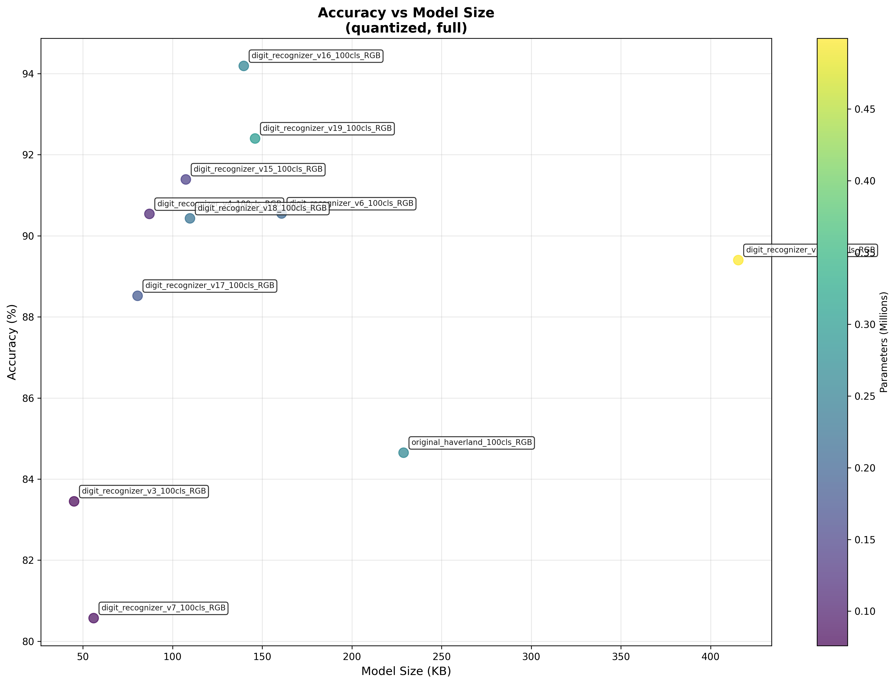

# Digit Recognition Benchmark Report

## 📊 Executive Summary

- **Test Date**: 2026-02-27 14:35:16
- **Models Tested**: 11 quantized models
- **Best IoT Model**: **digit_recognizer_v3.tflite** (45.1KB, 0.789 acc, 2695 inf/s)
- **Best Accuracy**: **digit_recognizer_v16.tflite** (0.894)
- **Fastest Model**: **digit_recognizer_v4.tflite** (3190 inf/s)
- **Smallest Model**: **digit_recognizer_v3.tflite** (45.1 KB)

## 📈 Performance vs Size

## 📋 Detailed Results

| Model | Size (KB) | Accuracy | Inf/s | Parameters | IoT Score |
|-------|-----------|----------|-------|------------|-----------|
| digit_recognizer_v3.tflite | 45.1 | 0.789 | 2695 | 75900 | 0.910 |
| digit_recognizer_v4.tflite | 87.1 | 0.860 | 3190 | 111500 | 0.836 |
| digit_recognizer_v17.tflite | 80.5 | 0.823 | 2485 | 183300 | 0.784 |
| digit_recognizer_v7.tflite | 56.0 | 0.749 | 1939 | 85500 | 0.782 |
| mnist_quantization.tflite | 72.2 | 0.812 | 1707 | 108000 | 0.749 |
| digit_recognizer_v15.tflite | 107.4 | 0.849 | 1476 | 145400 | 0.693 |
| digit_recognizer_v16.tflite | 139.7 | 0.894 | 1297 | 255800 | 0.678 |
| digit_recognizer_v9.tflite | 160.0 | 0.861 | 823 | 914600 | 0.618 |
| original_haverland.tflite | 228.8 | 0.820 | 1418 | 263600 | 0.607 |
| digit_recognizer_v6.tflite | 160.8 | 0.857 | 634 | 209300 | 0.603 |
| digit_recognizer_v12.tflite | 415.4 | 0.892 | 783 | 499300 | 0.580 |

## 💡 IoT-Specific Recommendations

### 🏆 Dynamic IoT Model Selection

#### 🎯 Best Overall for ESP32
- **Model**: **digit_recognizer_v3.tflite**
- **IoT Score**: 0.910
- **Accuracy**: 0.789
- **Size**: 45.1 KB
- **Speed**: 2695 inf/s
- **Efficiency**: 0.0175 accuracy per KB

#### 📊 IoT Model Comparison (Under 100KB)
| Model | Accuracy | Size | Speed | IoT Score | Use Case |
|-------|----------|------|-------|-----------|----------|
| digit_recognizer_v3.tflite | 0.789 | 45.1KB | 2695/s | 0.910 | 🏆 **BEST BALANCED** |
| digit_recognizer_v4.tflite | 0.860 | 87.1KB | 3190/s | 0.836 | 🎯 Best Accuracy |
| digit_recognizer_v17.tflite | 0.823 | 80.5KB | 2485/s | 0.784 | Alternative |
| digit_recognizer_v7.tflite | 0.749 | 56.0KB | 1939/s | 0.782 | Alternative |
| mnist_quantization.tflite | 0.812 | 72.2KB | 1707/s | 0.749 | Alternative |

#### 🔧 Alternative IoT Scenarios

**For Accuracy-Critical IoT:**
- **Choice**: digit_recognizer_v4.tflite
- **Accuracy**: 0.860 (best under 100KB)
- **Trade-off**: 87.1KB size

**For Speed-Critical IoT:**
- **Choice**: digit_recognizer_v4.tflite
- **Speed**: 3190 inf/s (fastest under 100KB)
- **Trade-off**: 0.860 accuracy

**For Memory-Constrained IoT:**
- **Choice**: digit_recognizer_v16.tflite
- **Size**: 139.7KB (smallest with ≥85% accuracy)
- **Trade-off**: 0.894 accuracy

#### 📈 Efficiency Analysis
| Model | Acc/KB | Acc/Param | Parameters | Verdict |
|-------|--------|-----------|------------|---------|
| digit_recognizer_v3.tflite | 0.0175 | 10.393939393939394 | 75900 | 🎯 **OPTIMAL** |
| digit_recognizer_v4.tflite | 0.0099 | 7.710313901345291 | 111500 | ⚖️ Good |
| digit_recognizer_v17.tflite | 0.0102 | 4.490452809601747 | 183300 | ⚖️ Good |
| digit_recognizer_v7.tflite | 0.0134 | 8.761403508771929 | 85500 | ⚖️ Good |
| mnist_quantization.tflite | 0.0112 | 7.519444444444445 | 108000 | ⚖️ Good |

---
*Report generated automatically by Digit Recognition Benchmarking Tool*
