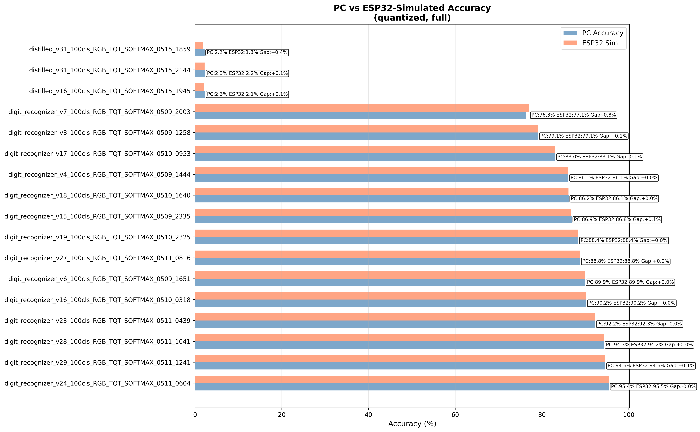
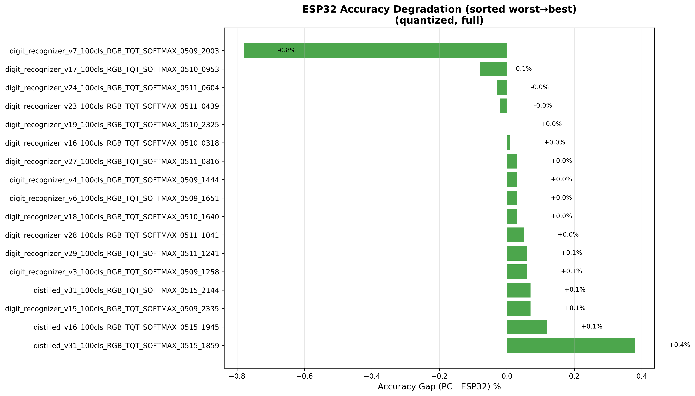
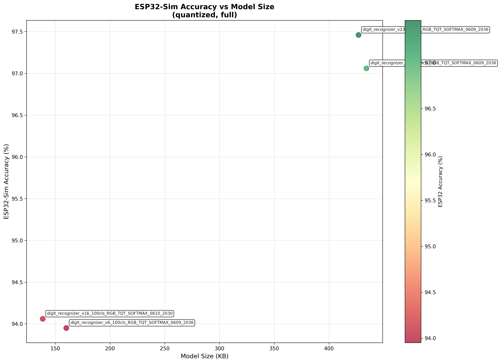

# Digit Recognition Benchmark Report

## 🔌 ESP32 Hardware Simulation

> **What this is**: Each model was also tested through an ESP32-simulated inference pipeline that adds quantization noise to simulate the integer-only arithmetic of TFLite Micro on ESP32. Models with a smaller gap between PC and ESP32 accuracy are more robust for real hardware deployment.

| Model | PC Accuracy | ESP32 Sim. | Gap | Verdict |
|-------|-------------|------------|-----|---------|
| digit_recognizer_v23_full_integer_quant.tflite | 0.975 | 0.975 | -0.0% | ✅ Excellent (robust) |
| digit_recognizer_v24_full_integer_quant.tflite | 0.970 | 0.971 | -0.0% | ✅ Excellent (robust) |
| digit_recognizer_v16_full_integer_quant.tflite | 0.942 | 0.941 | +0.1% | ✅ Excellent (robust) |
| digit_recognizer_v6_full_integer_quant.tflite | 0.940 | 0.940 | +0.0% | ✅ Excellent (robust) |

### 📊 ESP32 Simulation Graphs

---

## 📊 Executive Summary

- **Test Date**: 2026-06-11 17:17:54
- **Models Tested**: 4 quantized models
- **Best IoT Model**: **digit_recognizer_v16_full_integer_quant.tflite** (138.6KB, 0.942 acc, 2066 inf/s)
- **Best Accuracy**: **digit_recognizer_v23_full_integer_quant.tflite** (0.975)
- **Fastest Model**: **digit_recognizer_v16_full_integer_quant.tflite** (2066 inf/s)
- **Smallest Model**: **digit_recognizer_v16_full_integer_quant.tflite** (138.6 KB)

## 📈 Performance vs Size

## 📋 Detailed Results

| Model | Size (KB) | Accuracy | Inf/s | Parameters | IoT Score |
|-------|-----------|----------|-------|------------|-----------|
| digit_recognizer_v16_full_integer_quant.tflite | 138.6 | 0.942 | 2066 | 269500 | 0.983 |
| digit_recognizer_v6_full_integer_quant.tflite | 160.1 | 0.940 | 1223 | 459000 | 0.860 |
| digit_recognizer_v23_full_integer_quant.tflite | 427.0 | 0.975 | 1018 | 661400 | 0.696 |
| digit_recognizer_v24_full_integer_quant.tflite | 434.2 | 0.970 | 972 | 673700 | 0.688 |

## 💡 IoT-Specific Recommendations

### 🏆 Dynamic IoT Model Selection

#### 🎯 Best Overall for ESP32
- **Model**: **digit_recognizer_v16_full_integer_quant.tflite**
- **IoT Score**: 0.983
- **Accuracy**: 0.942
- **Size**: 138.6 KB
- **Speed**: 2066 inf/s
- **Efficiency**: 0.0068 accuracy per KB

#### 📊 IoT Model Comparison (Under 100KB)
| Model | Accuracy | Size | Speed | IoT Score | Use Case |
|-------|----------|------|-------|-----------|----------|
| *No models under 100KB* | - | - | - | - | - |

#### 🔧 Alternative IoT Scenarios

**For Accuracy-Critical IoT:** Choice: digit_recognizer_v16_full_integer_quant.tflite, Accuracy: 0.942, Trade-off: 138.6KB

**For Speed-Critical IoT:** Choice: digit_recognizer_v16_full_integer_quant.tflite, Speed: 2066 inf/s, Trade-off: 0.942 accuracy

**For Memory-Constrained IoT:** Choice: digit_recognizer_v16_full_integer_quant.tflite, Size: 138.6KB, Trade-off: 0.942 accuracy

---
*Report generated automatically by Digit Recognition Benchmarking Tool*
