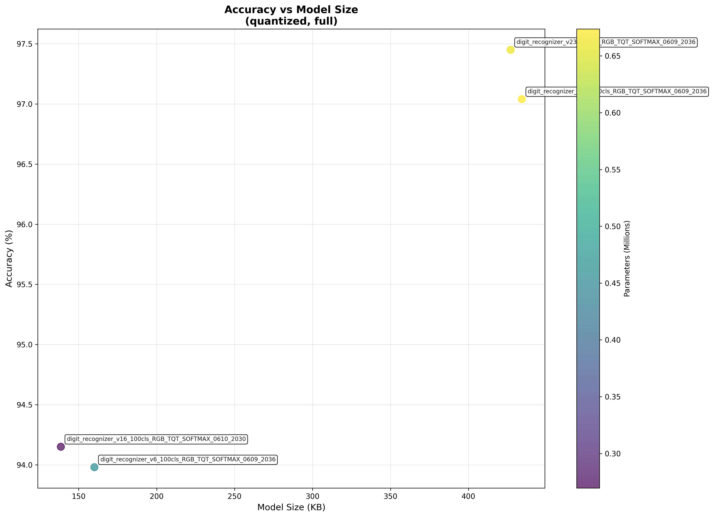

# Digit Recognition Benchmark Report

## 📊 Executive Summary

- **Test Date**: 2026-04-04 15:08:19
- **Models Tested**: 16 quantized models
- **Best IoT Model**: **digit_recognizer_v3.tflite** (45.1KB, 0.825 acc, 3978 inf/s)
- **Best Accuracy**: **v32_xl.tflite** (0.964)
- **Fastest Model**: **digit_recognizer_v7.tflite** (5255 inf/s)
- **Smallest Model**: **digit_recognizer_v3.tflite** (45.1 KB)

## 📈 Performance vs Size

## 📋 Detailed Results

| Model | Size (KB) | Accuracy | Inf/s | Parameters | IoT Score |
|-------|-----------|----------|-------|------------|-----------|
| digit_recognizer_v3.tflite | 45.1 | 0.825 | 3978 | 119200 | 0.879 |
| digit_recognizer_v7.tflite | 56.0 | 0.797 | 5255 | 120100 | 0.855 |
| digit_recognizer_v4.tflite | 87.1 | 0.907 | 3585 | 180700 | 0.762 |
| digit_recognizer_v17.tflite | 80.5 | 0.875 | 2807 | 200600 | 0.729 |
| digit_recognizer_v15.tflite | 107.4 | 0.904 | 2621 | 262100 | 0.695 |
| digit_recognizer_v18.tflite | 109.7 | 0.894 | 2516 | 240800 | 0.683 |
| digit_recognizer_v16.tflite | 139.7 | 0.934 | 2206 | 273200 | 0.665 |
| digit_recognizer_v19.tflite | 146.0 | 0.914 | 1883 | 316500 | 0.639 |
| original_haverland.tflite | 228.8 | 0.838 | 3218 | 350000 | 0.616 |
| digit_recognizer_v6.tflite | 160.8 | 0.895 | 1154 | 462800 | 0.592 |
| digit_recognizer_v24.tflite | 433.6 | 0.939 | 927 | 673600 | 0.554 |
| digit_recognizer_v29.tflite | 437.5 | 0.939 | 890 | 691400 | 0.552 |
| digit_recognizer_v28.tflite | 432.8 | 0.924 | 950 | 675500 | 0.547 |
| digit_recognizer_v27.tflite | 433.4 | 0.917 | 926 | 675500 | 0.542 |
| digit_recognizer_v23.tflite | 427.4 | 0.906 | 988 | 665200 | 0.539 |
| v32_xl.tflite | 2110.5 | 0.964 | 382 | 2600000 | 0.521 |

## 💡 IoT-Specific Recommendations

### 🏆 Dynamic IoT Model Selection

#### 🎯 Best Overall for ESP32
- **Model**: **digit_recognizer_v3.tflite**
- **IoT Score**: 0.879
- **Accuracy**: 0.825
- **Size**: 45.1 KB
- **Speed**: 3978 inf/s
- **Efficiency**: 0.0183 accuracy per KB

#### 📊 IoT Model Comparison (Under 100KB)
| Model | Accuracy | Size | Speed | IoT Score | Use Case |
|-------|----------|------|-------|-----------|----------|
| digit_recognizer_v3.tflite | 0.825 | 45.1KB | 3978/s | 0.879 | 🏆 **BEST BALANCED** |
| digit_recognizer_v7.tflite | 0.797 | 56.0KB | 5255/s | 0.855 | ⚡ Fastest |
| digit_recognizer_v4.tflite | 0.907 | 87.1KB | 3585/s | 0.762 | 🎯 Best Accuracy |
| digit_recognizer_v17.tflite | 0.875 | 80.5KB | 2807/s | 0.729 | Alternative |

#### 🔧 Alternative IoT Scenarios

**For Accuracy-Critical IoT:**
- **Choice**: digit_recognizer_v4.tflite
- **Accuracy**: 0.907 (best under 100KB)
- **Trade-off**: 87.1KB size

**For Speed-Critical IoT:**
- **Choice**: digit_recognizer_v7.tflite
- **Speed**: 5255 inf/s (fastest under 100KB)
- **Trade-off**: 0.797 accuracy

**For Memory-Constrained IoT:**
- **Choice**: digit_recognizer_v4.tflite
- **Size**: 87.1KB (smallest with ≥85% accuracy)
- **Trade-off**: 0.907 accuracy

#### 📈 Efficiency Analysis
| Model | Acc/KB | Acc/Param | Parameters | Verdict |
|-------|--------|-----------|------------|---------|
| digit_recognizer_v3.tflite | 0.0183 | 6.921979865771811 | 119200 | 🎯 **OPTIMAL** |
| digit_recognizer_v7.tflite | 0.0142 | 6.636136552872607 | 120100 | ⚖️ Good |
| digit_recognizer_v4.tflite | 0.0104 | 5.01715550636414 | 180700 | ⚖️ Good |
| digit_recognizer_v17.tflite | 0.0109 | 4.361415752741775 | 200600 | ⚖️ Good |
| digit_recognizer_v15.tflite | 0.0084 | 3.4509729111026326 | 262100 | ❌ Too large |

---
*Report generated automatically by Digit Recognition Benchmarking Tool*
