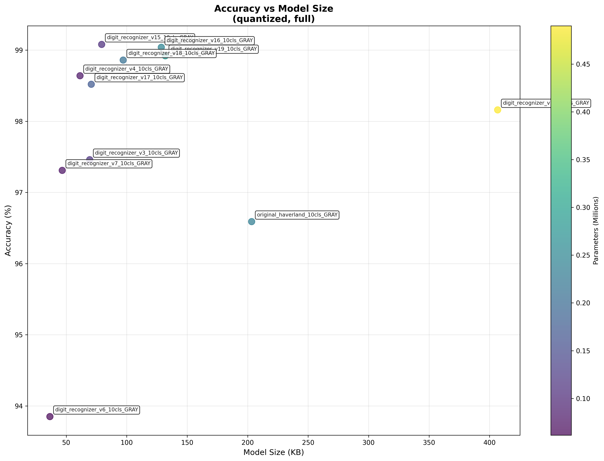

# Digit Recognition Benchmark Report

## 📊 Executive Summary

- **Test Date**: 2026-02-27 08:35:07
- **Models Tested**: 13 quantized models
- **Best IoT Model**: **digit_recognizer_v6.tflite** (36.5KB, 0.965 acc, 5167 inf/s)
- **Best Accuracy**: **digit_recognizer_v12.tflite** (0.993)
- **Fastest Model**: **digit_recognizer_v7.tflite** (6485 inf/s)
- **Smallest Model**: **digit_recognizer_v6.tflite** (36.5 KB)

## 📈 Performance vs Size

## 📋 Detailed Results

| Model | Size (KB) | Accuracy | Inf/s | Parameters | IoT Score |
|-------|-----------|----------|-------|------------|-----------|
| digit_recognizer_v6.tflite | 36.5 | 0.965 | 5167 | 61500 | 0.945 |
| digit_recognizer_v7.tflite | 46.7 | 0.966 | 6485 | 75600 | 0.921 |
| digit_recognizer_v4.tflite | 61.4 | 0.985 | 5834 | 79700 | 0.855 |
| digit_recognizer_v3.tflite | 69.4 | 0.980 | 6359 | 118400 | 0.848 |
| digit_recognizer_v17.tflite | 70.7 | 0.990 | 4971 | 172900 | 0.807 |
| mnist_quantization.tflite | 63.6 | 0.970 | 4719 | 98700 | 0.807 |
| digit_recognizer_v15.tflite | 79.3 | 0.991 | 5184 | 109100 | 0.797 |
| digit_recognizer_v16.tflite | 128.6 | 0.992 | 3690 | 244000 | 0.699 |
| original_haverland.tflite | 203.3 | 0.982 | 4513 | 234500 | 0.688 |
| digit_recognizer_v9.tflite | 148.6 | 0.990 | 2350 | 902500 | 0.645 |
| digit_recognizer_v12.tflite | 406.7 | 0.993 | 1570 | 490000 | 0.575 |
| digit_recognizer_v8.tflite | 396.4 | 0.991 | 1211 | 602700 | 0.564 |
| digit_recognizer_v11.tflite | 1370.8 | 0.989 | 1012 | 2800000 | 0.537 |

## 💡 IoT-Specific Recommendations

### 🏆 Dynamic IoT Model Selection

#### 🎯 Best Overall for ESP32
- **Model**: **digit_recognizer_v6.tflite**
- **IoT Score**: 0.945
- **Accuracy**: 0.965
- **Size**: 36.5 KB
- **Speed**: 5167 inf/s
- **Efficiency**: 0.0264 accuracy per KB

#### 📊 IoT Model Comparison (Under 100KB)
| Model | Accuracy | Size | Speed | IoT Score | Use Case |
|-------|----------|------|-------|-----------|----------|
| digit_recognizer_v6.tflite | 0.965 | 36.5KB | 5167/s | 0.945 | 🏆 **BEST BALANCED** |
| digit_recognizer_v7.tflite | 0.966 | 46.7KB | 6485/s | 0.921 | ⚡ Fastest |
| digit_recognizer_v4.tflite | 0.985 | 61.4KB | 5834/s | 0.855 | Alternative |
| digit_recognizer_v3.tflite | 0.980 | 69.4KB | 6359/s | 0.848 | Alternative |
| digit_recognizer_v17.tflite | 0.990 | 70.7KB | 4971/s | 0.807 | Alternative |

#### 🔧 Alternative IoT Scenarios

**For Accuracy-Critical IoT:**
- **Choice**: digit_recognizer_v15.tflite
- **Accuracy**: 0.991 (best under 100KB)
- **Trade-off**: 79.3KB size

**For Speed-Critical IoT:**
- **Choice**: digit_recognizer_v7.tflite
- **Speed**: 6485 inf/s (fastest under 100KB)
- **Trade-off**: 0.966 accuracy

**For Memory-Constrained IoT:**
- **Choice**: digit_recognizer_v6.tflite
- **Size**: 36.5KB (smallest with ≥85% accuracy)
- **Trade-off**: 0.965 accuracy

#### 📈 Efficiency Analysis
| Model | Acc/KB | Acc/Param | Parameters | Verdict |
|-------|--------|-----------|------------|---------|
| digit_recognizer_v6.tflite | 0.0264 | 15.689430894308943 | 61500 | 🎯 **OPTIMAL** |
| digit_recognizer_v7.tflite | 0.0207 | 12.777777777777777 | 75600 | ⚖️ Good |
| digit_recognizer_v4.tflite | 0.0160 | 12.361355081555834 | 79700 | ⚖️ Good |
| digit_recognizer_v3.tflite | 0.0141 | 8.27956081081081 | 118400 | ⚖️ Good |
| digit_recognizer_v17.tflite | 0.0140 | 5.72353961827646 | 172900 | ⚖️ Good |

---
*Report generated automatically by Digit Recognition Benchmarking Tool*
