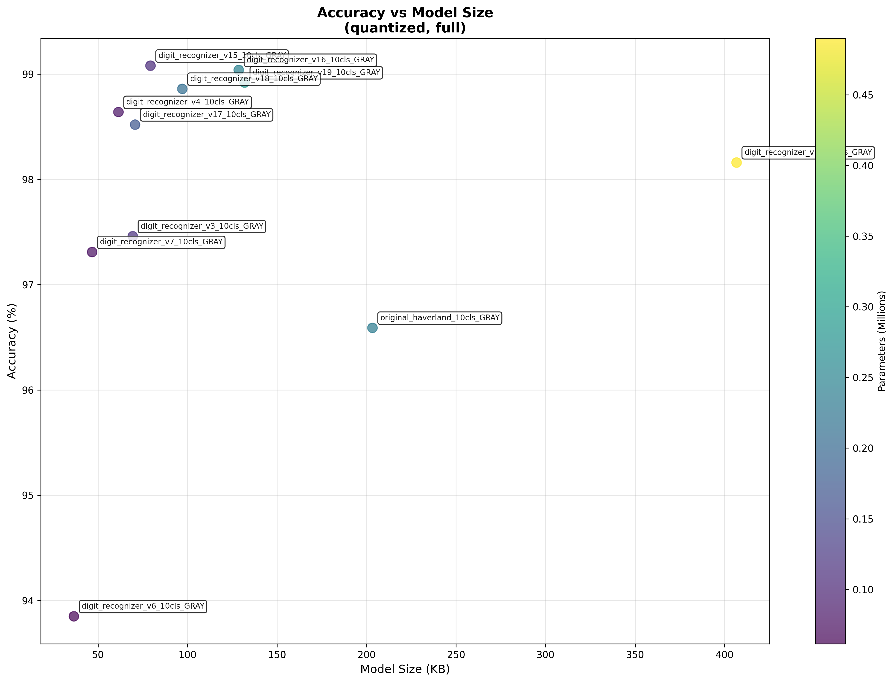

# Digit Recognition Benchmark Report

## 📊 Executive Summary

- **Test Date**: 2026-04-10 10:49:51
- **Models Tested**: 14 quantized models
- **Best IoT Model**: **digit_recognizer_v6.tflite** (36.5KB, 0.940 acc, 2785 inf/s)
- **Best Accuracy**: **digit_recognizer_v16.tflite** (0.985)
- **Fastest Model**: **digit_recognizer_v7.tflite** (3958 inf/s)
- **Smallest Model**: **digit_recognizer_v6.tflite** (36.5 KB)

## 📈 Performance vs Size

## 📋 Detailed Results

| Model | Size (KB) | Accuracy | Inf/s | Parameters | IoT Score |
|-------|-----------|----------|-------|------------|-----------|
| digit_recognizer_v6.tflite | 36.5 | 0.940 | 2785 | 153100 | 0.918 |
| digit_recognizer_v7.tflite | 46.7 | 0.950 | 3958 | 98000 | 0.917 |
| digit_recognizer_v4.tflite | 62.5 | 0.973 | 3868 | 143900 | 0.865 |
| digit_recognizer_v23.tflite | 61.5 | 0.973 | 3694 | 143900 | 0.859 |
| digit_recognizer_v28.tflite | 64.6 | 0.972 | 3169 | 149700 | 0.823 |
| digit_recognizer_v24.tflite | 65.3 | 0.977 | 3043 | 147800 | 0.817 |
| digit_recognizer_v3.tflite | 69.4 | 0.966 | 3327 | 175400 | 0.816 |
| digit_recognizer_v27.tflite | 65.2 | 0.970 | 2998 | 149700 | 0.812 |
| digit_recognizer_v15.tflite | 79.3 | 0.978 | 3012 | 215000 | 0.787 |
| digit_recognizer_v29.tflite | 69.3 | 0.978 | 2572 | 165200 | 0.784 |
| digit_recognizer_v17.tflite | 70.7 | 0.975 | 2540 | 178100 | 0.778 |
| digit_recognizer_v18.tflite | 97.1 | 0.980 | 2234 | 215400 | 0.723 |
| digit_recognizer_v16.tflite | 129.6 | 0.985 | 2176 | 249300 | 0.694 |
| digit_recognizer_v19.tflite | 131.9 | 0.982 | 1731 | 289600 | 0.669 |

## 💡 IoT-Specific Recommendations

### 🏆 Dynamic IoT Model Selection

#### 🎯 Best Overall for ESP32
- **Model**: **digit_recognizer_v6.tflite**
- **IoT Score**: 0.918
- **Accuracy**: 0.940
- **Size**: 36.5 KB
- **Speed**: 2785 inf/s
- **Efficiency**: 0.0257 accuracy per KB

#### 📊 IoT Model Comparison (Under 100KB)
| Model | Accuracy | Size | Speed | IoT Score | Use Case |
|-------|----------|------|-------|-----------|----------|
| digit_recognizer_v6.tflite | 0.940 | 36.5KB | 2785/s | 0.918 | 🏆 **BEST BALANCED** |
| digit_recognizer_v7.tflite | 0.950 | 46.7KB | 3958/s | 0.917 | ⚡ Fastest |
| digit_recognizer_v4.tflite | 0.973 | 62.5KB | 3868/s | 0.865 | Alternative |
| digit_recognizer_v23.tflite | 0.973 | 61.5KB | 3694/s | 0.859 | Alternative |
| digit_recognizer_v28.tflite | 0.972 | 64.6KB | 3169/s | 0.823 | Alternative |

#### 🔧 Alternative IoT Scenarios

**For Accuracy-Critical IoT:**
- **Choice**: digit_recognizer_v18.tflite
- **Accuracy**: 0.980 (best under 100KB)
- **Trade-off**: 97.1KB size

**For Speed-Critical IoT:**
- **Choice**: digit_recognizer_v7.tflite
- **Speed**: 3958 inf/s (fastest under 100KB)
- **Trade-off**: 0.950 accuracy

**For Memory-Constrained IoT:**
- **Choice**: digit_recognizer_v6.tflite
- **Size**: 36.5KB (smallest with ≥85% accuracy)
- **Trade-off**: 0.940 accuracy

#### 📈 Efficiency Analysis
| Model | Acc/KB | Acc/Param | Parameters | Verdict |
|-------|--------|-----------|------------|---------|
| digit_recognizer_v6.tflite | 0.0257 | 6.136512083605487 | 153100 | 🎯 **OPTIMAL** |
| digit_recognizer_v7.tflite | 0.0203 | 9.692857142857141 | 98000 | ⚖️ Good |
| digit_recognizer_v4.tflite | 0.0156 | 6.759555246699097 | 143900 | ⚖️ Good |
| digit_recognizer_v23.tflite | 0.0158 | 6.759555246699097 | 143900 | ⚖️ Good |
| digit_recognizer_v28.tflite | 0.0150 | 6.489645958583834 | 149700 | ⚖️ Good |

---
*Report generated automatically by Digit Recognition Benchmarking Tool*
