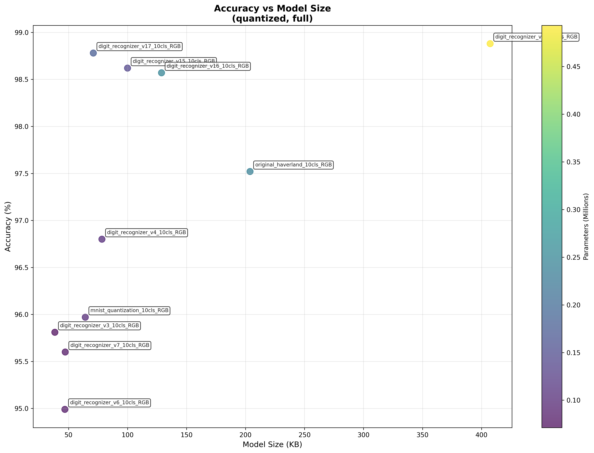

# Digit Recognition Benchmark Report

## 📊 Executive Summary

- **Test Date**: 2026-02-27 08:34:06
- **Models Tested**: 11 quantized models
- **Best IoT Model**: **digit_recognizer_v3.tflite** (38.4KB, 0.977 acc, 4789 inf/s)
- **Best Accuracy**: **digit_recognizer_v12.tflite** (0.993)
- **Fastest Model**: **digit_recognizer_v7.tflite** (6480 inf/s)
- **Smallest Model**: **digit_recognizer_v3.tflite** (38.4 KB)

## 📈 Performance vs Size

## 📋 Detailed Results

| Model | Size (KB) | Accuracy | Inf/s | Parameters | IoT Score |
|-------|-----------|----------|-------|------------|-----------|
| digit_recognizer_v3.tflite | 38.4 | 0.977 | 4789 | 71200 | 0.940 |
| digit_recognizer_v7.tflite | 47.2 | 0.967 | 6480 | 78600 | 0.931 |
| digit_recognizer_v6.tflite | 46.9 | 0.961 | 3844 | 79500 | 0.848 |
| digit_recognizer_v4.tflite | 78.3 | 0.987 | 6128 | 104700 | 0.833 |
| digit_recognizer_v17.tflite | 71.0 | 0.988 | 4764 | 175700 | 0.807 |
| mnist_quantization.tflite | 64.2 | 0.970 | 4479 | 101900 | 0.806 |
| digit_recognizer_v15.tflite | 100.0 | 0.992 | 3946 | 140000 | 0.736 |
| digit_recognizer_v16.tflite | 128.8 | 0.992 | 3491 | 246800 | 0.697 |
| original_haverland.tflite | 203.8 | 0.982 | 4151 | 240200 | 0.679 |
| digit_recognizer_v9.tflite | 149.1 | 0.990 | 2102 | 905600 | 0.640 |
| digit_recognizer_v12.tflite | 407.3 | 0.993 | 1438 | 493100 | 0.573 |

## 💡 IoT-Specific Recommendations

### 🏆 Dynamic IoT Model Selection

#### 🎯 Best Overall for ESP32
- **Model**: **digit_recognizer_v3.tflite**
- **IoT Score**: 0.940
- **Accuracy**: 0.977
- **Size**: 38.4 KB
- **Speed**: 4789 inf/s
- **Efficiency**: 0.0254 accuracy per KB

#### 📊 IoT Model Comparison (Under 100KB)
| Model | Accuracy | Size | Speed | IoT Score | Use Case |
|-------|----------|------|-------|-----------|----------|
| digit_recognizer_v3.tflite | 0.977 | 38.4KB | 4789/s | 0.940 | 🏆 **BEST BALANCED** |
| digit_recognizer_v7.tflite | 0.967 | 47.2KB | 6480/s | 0.931 | ⚡ Fastest |
| digit_recognizer_v6.tflite | 0.961 | 46.9KB | 3844/s | 0.848 | Alternative |
| digit_recognizer_v4.tflite | 0.987 | 78.3KB | 6128/s | 0.833 | Alternative |
| digit_recognizer_v17.tflite | 0.988 | 71.0KB | 4764/s | 0.807 | Alternative |

#### 🔧 Alternative IoT Scenarios

**For Accuracy-Critical IoT:**
- **Choice**: digit_recognizer_v15.tflite
- **Accuracy**: 0.992 (best under 100KB)
- **Trade-off**: 100.0KB size

**For Speed-Critical IoT:**
- **Choice**: digit_recognizer_v7.tflite
- **Speed**: 6480 inf/s (fastest under 100KB)
- **Trade-off**: 0.967 accuracy

**For Memory-Constrained IoT:**
- **Choice**: digit_recognizer_v3.tflite
- **Size**: 38.4KB (smallest with ≥85% accuracy)
- **Trade-off**: 0.977 accuracy

#### 📈 Efficiency Analysis
| Model | Acc/KB | Acc/Param | Parameters | Verdict |
|-------|--------|-----------|------------|---------|
| digit_recognizer_v3.tflite | 0.0254 | 13.720505617977528 | 71200 | 🎯 **OPTIMAL** |
| digit_recognizer_v7.tflite | 0.0205 | 12.305343511450381 | 78600 | ⚖️ Good |
| digit_recognizer_v6.tflite | 0.0205 | 12.09308176100629 | 79500 | ⚖️ Good |
| digit_recognizer_v4.tflite | 0.0126 | 9.428844317096466 | 104700 | ⚖️ Good |
| digit_recognizer_v17.tflite | 0.0139 | 5.623790552077404 | 175700 | ⚖️ Good |

---
*Report generated automatically by Digit Recognition Benchmarking Tool*
