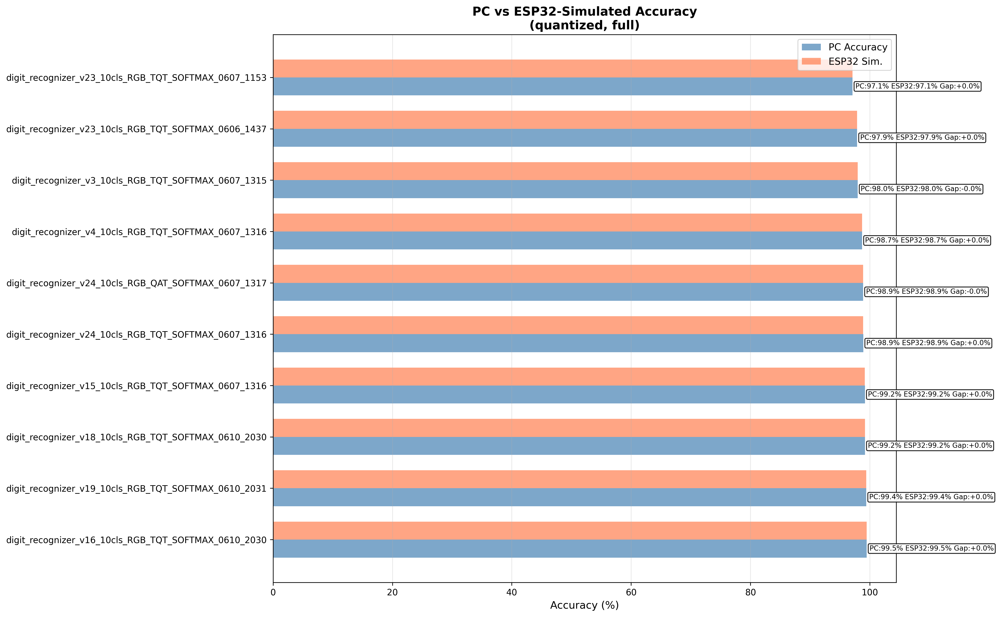
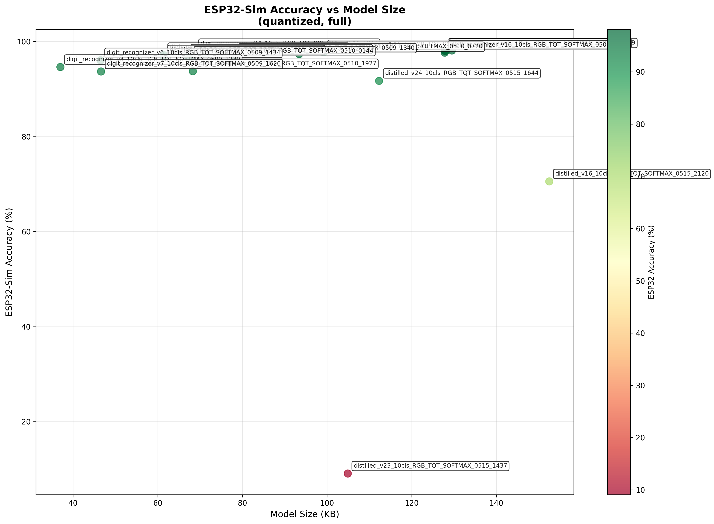

# Digit Recognition Benchmark Report

## 🔌 ESP32 Hardware Simulation

> **What this is**: Each model was also tested through an ESP32-simulated inference pipeline that adds quantization noise to simulate the integer-only arithmetic of TFLite Micro on ESP32. Models with a smaller gap between PC and ESP32 accuracy are more robust for real hardware deployment.

| Model | PC Accuracy | ESP32 Sim. | Gap | Verdict |
|-------|-------------|------------|-----|---------|
| digit_recognizer_v16_quantized_full_integer_quant.tflite | 0.981 | 0.981 | -0.0% | ✅ Excellent (robust) |
| digit_recognizer_v16.tflite | 0.981 | 0.981 | -0.0% | ✅ Excellent (robust) |
| digit_recognizer_v19_quantized_full_integer_quant.tflite | 0.981 | 0.981 | -0.0% | ✅ Excellent (robust) |
| digit_recognizer_v16_quantized_full_integer_quant.tflite | 0.980 | 0.980 | +0.0% | ✅ Excellent (robust) |
| digit_recognizer_v24_quantized_full_integer_quant.tflite | 0.980 | 0.980 | -0.0% | ✅ Excellent (robust) |
| digit_recognizer_v15_quantized_full_integer_quant.tflite | 0.978 | 0.978 | +0.0% | ✅ Excellent (robust) |
| digit_recognizer_v16_quantized_full_integer_quant.tflite | 0.977 | 0.977 | +0.1% | ✅ Excellent (robust) |
| digit_recognizer_v18_quantized_full_integer_quant.tflite | 0.974 | 0.974 | +0.0% | ✅ Excellent (robust) |
| digit_recognizer_v16.tflite | 0.974 | 0.973 | +0.0% | ✅ Excellent (robust) |
| digit_recognizer_v23_quantized_full_integer_quant.tflite | 0.972 | 0.972 | +0.0% | ✅ Excellent (robust) |
| digit_recognizer_v4_quantized_full_integer_quant.tflite | 0.971 | 0.970 | +0.0% | ✅ Excellent (robust) |
| digit_recognizer_v16.tflite | 0.969 | 0.969 | +0.1% | ✅ Excellent (robust) |
| v23_full_integer_quant.tflite | 0.967 | 0.967 | -0.0% | ✅ Excellent (robust) |
| digit_recognizer_v17_quantized_full_integer_quant.tflite | 0.964 | 0.964 | +0.0% | ✅ Excellent (robust) |
| digit_recognizer_v6_quantized_full_integer_quant.tflite | 0.961 | 0.961 | +0.0% | ✅ Excellent (robust) |
| digit_recognizer_v3_quantized_full_integer_quant.tflite | 0.946 | 0.947 | -0.0% | ✅ Excellent (robust) |
| digit_recognizer_v27_quantized_full_integer_quant.tflite | 0.937 | 0.938 | -0.0% | ✅ Excellent (robust) |
| digit_recognizer_v7_quantized_full_integer_quant.tflite | 0.937 | 0.937 | +0.0% | ✅ Excellent (robust) |
| v24_esp32_quantized_full_integer_quant.tflite | 0.917 | 0.917 | +0.0% | ✅ Excellent (robust) |
| v16_esp32_quantized_full_integer_quant.tflite | 0.706 | 0.706 | +0.0% | ✅ Excellent (robust) |
| v23_esp32_quantized_full_integer_quant.tflite | 0.090 | 0.091 | -0.0% | ✅ Excellent (robust) |

### 📊 ESP32 Simulation Graphs

---

## 📊 Executive Summary

- **Test Date**: 2026-05-16 16:53:28
- **Models Tested**: 21 quantized models
- **Best IoT Model**: **digit_recognizer_v7_quantized_full_integer_quant.tflite** (46.6KB, 0.937 acc, 1809 inf/s)
- **Best Accuracy**: **digit_recognizer_v16_quantized_full_integer_quant.tflite** (0.981)
- **Fastest Model**: **digit_recognizer_v7_quantized_full_integer_quant.tflite** (1809 inf/s)
- **Smallest Model**: **digit_recognizer_v3_quantized_full_integer_quant.tflite** (37.0 KB)

## 📈 Performance vs Size

## 📋 Detailed Results

| Model | Size (KB) | Accuracy | Inf/s | Parameters | IoT Score |
|-------|-----------|----------|-------|------------|-----------|
| digit_recognizer_v7_quantized_full_integer_quant.tflite | 46.6 | 0.937 | 1809 | 109500 | 0.916 |
| digit_recognizer_v23_quantized_full_integer_quant.tflite | 61.4 | 0.972 | 1690 | 143900 | 0.863 |
| v23_full_integer_quant.tflite | 61.4 | 0.967 | 1599 | 143900 | 0.850 |
| digit_recognizer_v3_quantized_full_integer_quant.tflite | 37.0 | 0.946 | 611 | 93400 | 0.850 |
| digit_recognizer_v6_quantized_full_integer_quant.tflite | 46.5 | 0.961 | 965 | 193900 | 0.835 |
| digit_recognizer_v17_quantized_full_integer_quant.tflite | 67.6 | 0.964 | 1167 | 189300 | 0.785 |
| digit_recognizer_v24_quantized_full_integer_quant.tflite | 68.7 | 0.980 | 1036 | 156200 | 0.775 |
| v24_esp32_quantized_full_integer_quant.tflite | 112.3 | 0.917 | 1609 | 207000 | 0.744 |
| digit_recognizer_v15_quantized_full_integer_quant.tflite | 99.2 | 0.978 | 1172 | 252900 | 0.740 |
| digit_recognizer_v18_quantized_full_integer_quant.tflite | 93.4 | 0.974 | 1053 | 226700 | 0.732 |
| digit_recognizer_v16.tflite | 66.9 | 0.969 | 430 | 154200 | 0.707 |
| digit_recognizer_v16.tflite | 71.2 | 0.974 | 360 | 169700 | 0.692 |
| digit_recognizer_v16_quantized_full_integer_quant.tflite | 127.8 | 0.981 | 928 | 260600 | 0.689 |
| digit_recognizer_v27_quantized_full_integer_quant.tflite | 68.3 | 0.937 | 422 | 156800 | 0.687 |
| digit_recognizer_v4_quantized_full_integer_quant.tflite | 78.2 | 0.971 | 452 | 170200 | 0.687 |
| digit_recognizer_v16_quantized_full_integer_quant.tflite | 127.8 | 0.980 | 880 | 260600 | 0.684 |
| digit_recognizer_v16_quantized_full_integer_quant.tflite | 127.8 | 0.977 | 875 | 260600 | 0.682 |
| digit_recognizer_v16.tflite | 129.5 | 0.981 | 858 | 260500 | 0.681 |
| digit_recognizer_v19_quantized_full_integer_quant.tflite | 128.1 | 0.981 | 739 | 300900 | 0.668 |
| v16_esp32_quantized_full_integer_quant.tflite | 152.5 | 0.706 | 1215 | 331300 | 0.567 |
| v23_esp32_quantized_full_integer_quant.tflite | 104.9 | 0.090 | 1713 | 173200 | 0.341 |

## 💡 IoT-Specific Recommendations

### 🏆 Dynamic IoT Model Selection

#### 🎯 Best Overall for ESP32
- **Model**: **digit_recognizer_v7_quantized_full_integer_quant.tflite**
- **IoT Score**: 0.916
- **Accuracy**: 0.937
- **Size**: 46.6 KB
- **Speed**: 1809 inf/s
- **Efficiency**: 0.0201 accuracy per KB

#### 📊 IoT Model Comparison (Under 100KB)
| Model | Accuracy | Size | Speed | IoT Score | Use Case |
|-------|----------|------|-------|-----------|----------|
| digit_recognizer_v7_quantized_full_integer_quant.tflite | 0.937 | 46.6KB | 1809/s | 0.916 | 🏆 **BEST BALANCED** |
| digit_recognizer_v23_quantized_full_integer_quant.tflite | 0.972 | 61.4KB | 1690/s | 0.863 | Alternative |
| v23_full_integer_quant.tflite | 0.967 | 61.4KB | 1599/s | 0.850 | Alternative |
| digit_recognizer_v3_quantized_full_integer_quant.tflite | 0.946 | 37.0KB | 611/s | 0.850 | 💾 Smallest Adequate |
| digit_recognizer_v6_quantized_full_integer_quant.tflite | 0.961 | 46.5KB | 965/s | 0.835 | Alternative |

#### 🔧 Alternative IoT Scenarios

**For Accuracy-Critical IoT:**
- **Choice**: digit_recognizer_v24_quantized_full_integer_quant.tflite
- **Accuracy**: 0.980 (best under 100KB)
- **Trade-off**: 68.7KB size

**For Speed-Critical IoT:**
- **Choice**: digit_recognizer_v7_quantized_full_integer_quant.tflite
- **Speed**: 1809 inf/s (fastest under 100KB)
- **Trade-off**: 0.937 accuracy

**For Memory-Constrained IoT:**
- **Choice**: digit_recognizer_v3_quantized_full_integer_quant.tflite
- **Size**: 37.0KB (smallest with ≥85% accuracy)
- **Trade-off**: 0.946 accuracy

#### 📈 Efficiency Analysis
| Model | Acc/KB | Acc/Param | Parameters | Verdict |
|-------|--------|-----------|------------|---------|
| digit_recognizer_v7_quantized_full_integer_quant.tflite | 0.0201 | 8.55890410958904 | 109500 | 🎯 **OPTIMAL** |
| digit_recognizer_v23_quantized_full_integer_quant.tflite | 0.0158 | 6.753300903405142 | 143900 | ⚖️ Good |
| v23_full_integer_quant.tflite | 0.0157 | 6.717164697706741 | 143900 | ⚖️ Good |
| digit_recognizer_v3_quantized_full_integer_quant.tflite | 0.0256 | 10.130620985010706 | 93400 | ⚖️ Good |
| digit_recognizer_v6_quantized_full_integer_quant.tflite | 0.0207 | 4.954615781330583 | 193900 | ⚖️ Good |

---
*Report generated automatically by Digit Recognition Benchmarking Tool*
