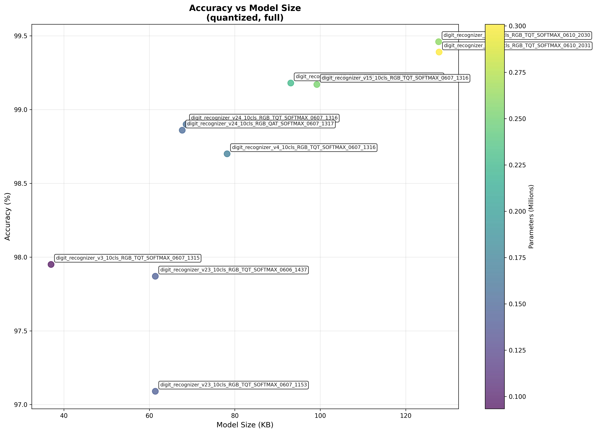

# Digit Recognizer

A deep learning project for rotating digit recognition using various neural network architectures.

## Overview

This project implements and compares different neural network models for recognizing rotating digits from [haverland dataset](https://github.com/haverland/Tenth-of-step-of-a-meter-digit). 

The goal is to explore the trade-offs between model complexity, size, and accuracy.

It's actually focused on 10 classes recognitions [0-9] but can works for 100 classes [0-99] And grayscale as it performs the same on test datasets

Grayscale or RGB runs the same on test datasets, but RGB need more resources at image processing level.

## Model Performance



The graph above shows the relationship between model accuracy and model size across different neural network architectures. As demonstrated, the project explores how different model complexities affect recognition performance.

## Directory Organization

The exported models in the `exported_models/` directory are organized by classification complexity and color space:
- `100cls_GRAY` and `100cls_RGB`: Stress-test models trained on 100 classes (0-99).
- `10cls_GRAY` and `10cls_RGB`: Standard digits models trained on 10 classes (0-9).

## Benchmark on 10 Classes (Standard Digits [0-9])

The primary use case is 10-class recognition. The models perform exceptionally well on grayscale images, offering high accuracy for IoT deployment.

| Model                          | Parameters | Size (KB) | Accuracy (RGB) | Inferences/sec |
| ------------------------------ | ---------- | --------- | -------------- | -------------- |
| digit_recognizer_v16_10cls_RGB | 246800     | 128.8     | 0.992          | 4960           |
| digit_recognizer_v18_10cls_RGB | 213000     | 97.4      | 0.990          | 4131           |
| digit_recognizer_v15_10cls_RGB | 140000     | 100.0     | 0.989          | 5506           |
| digit_recognizer_v19_10cls_RGB | 287200     | 132.2     | 0.988          | 3286           |
| digit_recognizer_v4_10cls_RGB  | 104700     | 78.3      | 0.988          | 6121           |
| digit_recognizer_v17_10cls_RGB | 175700     | 71.0      | 0.987          | 6256           |
| digit_recognizer_v12_10cls_RGB | 493100     | 407.3     | 0.983          | 1942           |
| digit_recognizer_v3_10cls_RGB  | 71200      | 38.4      | 0.973          | 4695           |
| digit_recognizer_v7_10cls_RGB  | 78600      | 47.2      | 0.970          | 6423           |
| original_haverland_10cls_RGB   | 240200     | 203.8     | 0.966          | 4286           |
| digit_recognizer_v6_10cls_RGB  | 79500      | 46.9      | 0.963          | 4047           |

### Pareto-Optimal Choices: `v16` and `v4` vs `original_haverland`

When comparing the `original_haverland` baseline to newer models on the 10-class dataset (RGB), both `v16` and `v4` demonstrate strict superiority across key edge-deployment metrics:

**For Maximum Accuracy (`v16`):**
1.  **Higher Accuracy**: `v16` achieves **99.2%** accuracy compared to the original's **96.6%**.
2.  **Smaller Memory Footprint**: `v16` is **128.8 KB**, making it substantially smaller than the original's **203.8 KB**.
3.  **Faster Inference**: `v16` processes **4960 inferences/second**, outperforming the original's **4286 inferences/second**.

**For Maximum Efficiency (`v4`):**
1.  **Higher Accuracy**: `v4` achieves **98.8%** accuracy compared to the original's **96.6%**.
2.  **Dramatically Smaller Memory Footprint**: `v4` is only **78.3 KB**, making it roughly **2.6x smaller** than the original's **203.8 KB**, saving critical flash memory on ESP32 devices.
3.  **Extremely Fast Inference**: `v4` processes **6121 inferences/second**, making it roughly **42% faster** than the original.

## Benchmark on 24351 real images (100 Classes [0-99])

To ensure a fair and comprehensive comparison between architectures under stress, the following benchmark utilizes the 100 classes (`0` to `99`) dataset, which represents a significantly harder classification task than the simple 0-9 digits.

| Model                          | Parameters | Size (KB) | Accuracy (RGB) | Inferences/sec |
| ------------------------------ | ---------- | --------- | -------------- | -------------- |
| digit_recognizer_v16_100cls_RGB| 255800     | 139.7     | 0.942          | 3456           |
| digit_recognizer_v19_100cls_RGB| 299100     | 146.0     | 0.924          | 3328           |
| digit_recognizer_v15_100cls_RGB| 145400     | 107.4     | 0.914          | 4140           |
| digit_recognizer_v6_100cls_RGB | 209300     | 160.8     | 0.906          | 1965           |
| digit_recognizer_v4_100cls_RGB | 111500     | 87.1      | 0.905          | 5766           |
| digit_recognizer_v18_100cls_RGB| 223400     | 109.7     | 0.904          | 4200           |
| digit_recognizer_v12_100cls_RGB| 499300     | 415.4     | 0.894          | 1470           |
| digit_recognizer_v17_100cls_RGB| 183300     | 80.5      | 0.885          | 4626           |
| original_haverland_100cls_RGB  | 263600     | 228.8     | 0.847          | 4190           |
| digit_recognizer_v3_100cls_RGB | 75900      | 45.1      | 0.835          | 4541           |
| digit_recognizer_v7_100cls_RGB | 85500      | 56.0      | 0.806          | 6162           |

### Performance under Stress: `v16` and `v4` vs `original_haverland` (100-Class)

Even on the harder dataset (RGB), both `v16` and `v4` maintain their strong edge over `original_haverland`:

**`v16` under stress:**
1.  **Higher Accuracy**: `v16` achieves **94.2%** accuracy compared to the original's **84.7%**.
2.  **Smaller Memory Footprint**: `v16` drops to **139.7 KB** while the original is **228.8 KB**.

**`v4` under stress:**
1.  **Higher Accuracy**: `v4` achieves **90.5%** accuracy compared to the original's **84.7%**.
2.  **Dramatically Smaller Memory Footprint**: `v4` drops to **87.1 KB** while the original is **228.8 KB**.
3.  **Faster Inference**: `v4` processes **5766 inferences/second**, beating the original's **4190 inferences/second**.

## Usage

### Training
To train a model, run:
```bash
python train.py --model digit_recognizer_v4 --classes 10 --color gray
```

#### Configuration Overrides
The training pipeline supports multiple ways to configure hyperparameters without interactive prompts:

1.  **CLI Arguments**: (Highest priority)
    - `--classes {10,100}`: Number of classification classes.
    - `--color {rgb,gray}`: Input image color mode.
    - `--model {architecture}`: Choose from `AVAILABLE_MODELS` in `parameters.py`.
    - `--focal-loss`: Enables Intelligent Focal Loss.

2.  **Environment Variables**:
    - `DIGIT_NB_CLASSES`: Sets the number of classes.
    - `DIGIT_INPUT_CHANNELS`: Sets to `1` (Gray) or `3` (RGB).
    - `DATASET_CACHE_DIR`: Directory for image caching.

3.  **Manual Overrides (parameters.py)**:
    - Set `MANUAL_NB_CLASSES` or `MANUAL_INPUT_CHANNELS` to a fixed value.

#### Non-Interactive Mode
If no configuration is provided and the terminal is detected as non-interactive (e.g., in a CI/CD pipeline or some IDEs), the script will automatically default to **10 classes** and **Grayscale** to avoid blocking.

## Advanced Training Features
- **Intelligent Focal Loss**: Replaces standard Cross-Entropy once the model masters the basics (default: >0.80 accuracy). Controlled via `LOSS_TYPE = "IntelligentFocalLossController"`.
- **Dynamic Alpha Scaling**: Scaling factor $\alpha$ for Focal Loss is automatically calculated based on class count to maintain class balance.
- **Adaptive Per-Class Weighting**: Dynamically adjusts importance of specific difficult digits during training.

## Benchmarking

## Documentation

For detailed guides analyzing how to train, benchmark, and debug the models within this repository, refer to the guides in the [`documentations/`](documentations/) folder:
- [Training Guide](documentations/training_guide.md)
- [Benchmarking & Prediction](documentations/benchmarking_and_prediction.md)
- [Analysis & Debugging](documentations/analysis_and_debugging.md)

- Pre-trained models
- **Advanced Training Features**:
    - **Intelligent Focal Loss**: Automatically switches from Cross-Entropy to Focal Loss based on validation performance.
    - **Dynamic Alpha Scaling**: Automatically adjusts class balancing based on dataset complexity (`NB_CLASSES`).
    - **Adaptive Per-Class Balancing**: Dynamically re-weights classes during training to focus on difficult samples.
    - **Quantization Aware Training (QAT)**: Integrated support for 8-bit quantization with ESP-DL compatibility.

## Results

The project demonstrates that :

 - Using training [Quantization aware training](https://www.tensorflow.org/model_optimization/guide/quantization/training) can lead to better results
 - tlite-micro or esp-dl compabilities suppress model operators (like relu6)
 - There is major differences between training efficiency and real tests
 - Model size "double" the tensor arena needed in memory
 - CPU operations must be also taken into parameters for IOT
 - RGB or grayscale has very same benchmark results, but the processing is not the same as in parameters needed. It also needs a lot of more cpu and memory to process
 - **Adaptive Loss Strategies**: Using `IntelligentFocalLossController` allows the model to master basic features with Cross-Entropy before focusing on hard-to-distinguish digits using Focal Loss.
 
 ## RGB vs Grayscale Model Comparison

 If the model uses Conv2D (first layer), it flattens all channels, which is why the theoretical benchmark results (accuracy and raw inference speed) are very similar between RGB and grayscale variants. 

 However, **RGB increases the pre-processing time in IoT devices by a significant factor**. The image processing pipeline must handle 3 times as much data (e.g., resizing and normalizing channels). Furthermore, the input tensor memory footprint (`H, W, 3`) takes substantially more RAM before inference even begins. Therefore, Grayscale (`10cls_GRAY`) is highly recommended for constrained microcontrollers.
 
 ##### How Conv2D Actually Works with Channels:
-   **Input**: `(height, width, channels)` - e.g., `(32, 20, 1)` for grayscale or `(32, 20, 3)` for RGB
-   **Conv2D with 32 filters**: Each filter has shape `(3, 3, channels)` and produces 1 output channel
-   **Output**: `(height, width, 32)` - 32 feature maps, each combining information from all input channels

## Summary of Model Choice and Application

The table below summarizes the trade-offs between accuracy and model size across different classification complexities (10 vs 100 classes) and color spaces (Grayscale vs RGB). It highlights the most notable models to help you choose the best fit for your specific IoT application.

| Model Name | 10 cls Gray | 10 cls RGB | 100 cls Gray | 100 cls RGB | Application / Comment |
| :--- | :--- | :--- | :--- | :--- | :--- |
| **v6** | 96.5% / 36.5KB | 96.3% / 46.9KB | 84.0% / 132.5KB | 90.5% / 160.8KB | Best balanced IoT model for 10cls Gray, extremely small memory footprint. |
| **v3** | 98.0% / 69.4KB | 97.3% / 38.4KB | 76.5% / 74.6KB | 83.5% / 45.1KB | Fast overall inference speed and best balanced for 100cls RGB. |
| **v7** | 96.6% / 46.7KB | 97.0% / 47.2KB | 75.4% / 55.5KB | 80.6% / 56.0KB | Fastest inference speed under 100KB, optimal for speed-critical IoT. |
| **v4** | 98.5% / 61.4KB | 98.8% / 78.3KB | 82.9% / 69.5KB | 90.5% / 87.1KB | Excellent accuracy while remaining under 100KB, great all-rounder. |
| **v15** | 99.1% / 79.3KB | 98.9% / 100.0KB | 85.4% / 86.0KB | 91.4% / 107.4KB | Best accuracy for models under 100KB in 10-class scenarios. |
| **v17** | 99.0% / 70.7KB | 98.7% / 71.0KB | 82.6% / 80.2KB | 88.5% / 80.5KB | Ultra-efficient GhostNet-inspired alternative with solid accuracy. |
| **v16** | 99.2% / 128.6KB | 99.2% / 128.8KB | 88.4% / 139.5KB | 94.2% / 139.7KB | High accuracy MobileNetV2-based model, excellent under stress. |
| **v18** | 98.9% / 97.1KB | 99.0% / 97.4KB | 90.2% / 109.4KB | 90.4% / 109.7KB | New variant with very strong performance hovering around 100KB. |
| **v19** | 98.9% / 131.9KB | 98.8% / 132.2KB | 91.6% / 145.6KB | 92.4% / 146.0KB | New high-capacity variant built for challenging 100-class scenarios. |
| **original_haverland** | 98.2% / 203.3KB | 96.6% / 203.8KB | 81.7% / 228.2KB | 84.7% / 228.8KB | Legacy baseline, superseded by v16 and newer variants. |
| **v12** | 99.3% / 406.7KB | 98.3% / 407.3KB | 89.2% / 414.8KB | 89.4% / 415.4KB | Best overall absolute accuracy under 1MB. Not suitable for constrained IoT. |
| **high_accuracy_validator** | N/A | N/A | N/A | 91.9% / 3149.7KB | PC-only large model validator, highest absolute accuracy found. |

## Related Projects

This work contributes to improved digit recognition research, including the [Tenth-of-step-of-a-meter-digit](https://github.com/haverland/Tenth-of-step-of-a-meter-digit) project for enhanced meter digit analysis.

## Contributing
Contributions are welcome! Please feel free to submit pull requests or open issues for suggestions.

## License
This project is licensed under the Apache-2.0 license
